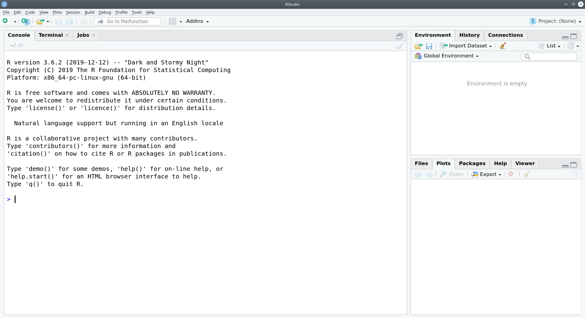
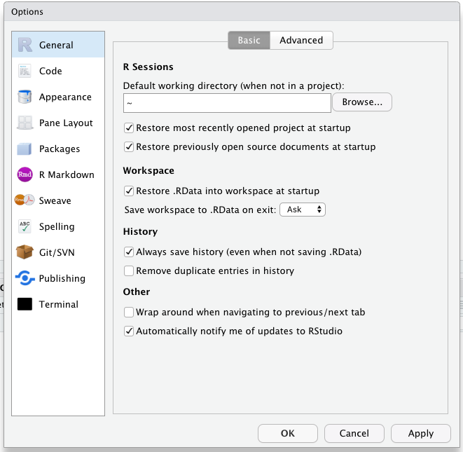
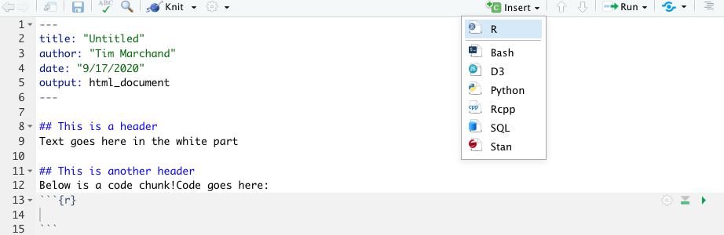
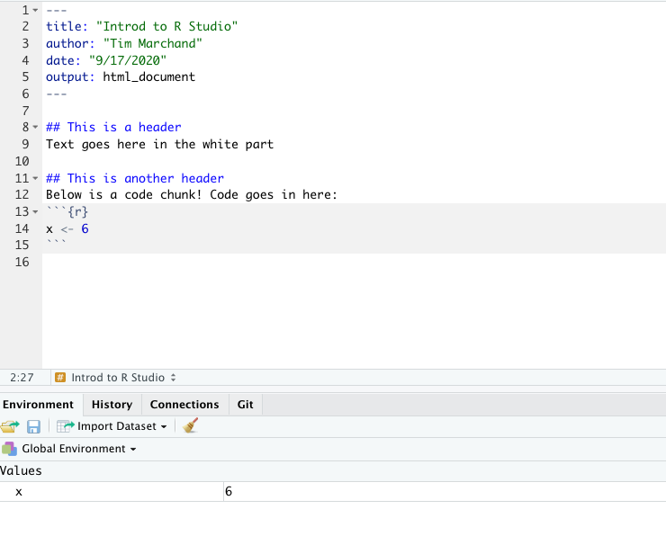

```{r setup, include=FALSE}
knitr::opts_chunk$set(echo = TRUE)
```


The goal this week is to introduce you to R and RStudio which you'll be using throughout the course both to review the statistical concepts discussed in the course and to analyze real data and come to informed conclusions.

To clarify which is which: R is the name of the programming language itself and RStudio is a convenient interface.

Today we begin with the fundamental building blocks of R and RStudio: the interface, creating and saving files, and basic commands.

# The RStudio Interface

In RStudio you should see a window that looks like the image below.

{width="100%"}

<br>

The panel on the left is where the action happens. It's called the *console*. Every time you launch RStudio, it will have the same text at the top of the console telling you the version of R that you're running.

The panel in the upper right contains your *workspace*. This shows the variables and objects you define during your R session, and a history of the commands that you enter.

Any plots that you generate will show up in the panel in the lower right corner. This is also where you can browse your files, and access help files, and upload and download files.

When you open an R script file or RMarkdown document, a *source* panel will open on the top left.

## Changing the panels on RStudio

RStudio is very flexible, and allows you to set up the interface in your preferred way. One common change is to set the panels so that the *workspace* panel is below the *source* panel on the right, and the *console* moves to the top left.

To change your own setup, go to menu bar and choose Tools \> Global Options \> Pane Layout

Switch the top right panel to *console*, click **Apply** and **OK**.

{height="30%"}

RStudio will then switch the *console* panel and *workspace* over automatically.

# Using R Markdown files

## Opening a new file

When you want to write a paper, you have to open a Word document to type your ideas into, and save your work in. In R we use a document type called an R Markdown document. R Markdown documents are useful for both running code, and annotating the code with comments. The document can be saved, so you can refer back to your code later, and can be used to create other document types (html, word, pdf, or slides) for presenting the results of your analyses. R Markdown provides a way to generate clear and reproducible data analyses.

To open a new file, click on the little green plus on the upper left hand, and select R Markdown, as in the image below. You can leave it untitled.

{width="250px"}

<br>

When you open a new R Markdown file, there is some example code in it that you can get rid of. We will take care of this next.

## Make changes to a file

Let's make some changes to the R Markdown file you just opened. Using the image below as a guide

-   First, change the title of the lab at the top to "Getting to know RStudio". Be sure to keep the quotation marks.
-   Second, add an author line, following the example below. You need quotation marks!
-   Third, delete everything in the document from line 7 downwards.
-   Fourth, add headers and text, **exactly** following the example below.
-   Finally, insert what is called a "code chunk." To do this you click on the **insert** button near the top center of the screen, then choose R. The greyed out box that shows up is where you type code.

Your final result should look like this:

{width="100%"}

## Saving a file

You will complete some class tasks in an R Markdown file like this each week, so it is important to learn how to save these files.

-   Click File \> Save As...
-   Browse to the folder where you want to store the R Markdown document and it's output.
-   Name the file something informative, e.g., `PS01_lastname_firstname` (fill in your first name and last name). Make sure to keep the `.Rmd` file extension.
-   Click save

::: {#license}
Keeping track of how you organize your folders and files, and being consistent, will help save you **a lot** of headaches as you start coding in R. It would be a good idea to create a folder where you store all your problem sets, or create one folder for each problem set. Either way, be consistent and pay attention to your organization.
:::

## Knitting an HTML file

Click the Knit button at the top left side of the screen to "knit" the file, or in other words, produce an output document. An `.html` file will be generated. It is automatically saved in the same folder that your R Markdown file was saved in.

<div>

If you see a pop-up in RStudio saying R Markdown requires updated versions of some packages, allow RStudio to upgrade those packages.

</div>

Inspect the `.html` file to see how what you typed was formatted. There are lots of tricks for controlling the formatting of the knitted html file. For instance:

-   putting `##` and a space in front of text makes it into a large header. For example, see how `## This is a header` in your R Markdown `.Rmd` file translates in the resulting `.html` output.
-   putting `###` and a space in front of text makes it a smaller header!

## Knitting a PDF file

If you are feeling adventurous, you can also try *knitting* a PDF file.

### LaTeX

Unfortunately, knitting your R Markdown document to a PDF requires another piece of external software called **LaTeX**. Fortunately, it is relatively easy to install LaTeX directly from your R console!

Go to your R console, and enter the command `install.packages('tinytex')`. When this package is finished installing, you should see text saying "package 'tinytex' successfully unpacked and MD5 sums checked" and "The downloaded binary packages are in...", and then the R console prompt `>` should return.

Now, enter the following command `tinytex::install_tinytex()`, which should complete the LaTeX installation you need. After it finishes, close RStudio and open it again, to restart your R session that includes LaTeX.

<div>

If RStudio asks you if you want to save you workspace when you close it, choose "No", and don't save your workspace.

</div>

### Knit to PDF

Now, click the small black arrow next to the "Knit" button to open the drop-down menu, and select "Knit to PDF".


<br>

In a moment, you should see a PDF pop-up. If you don't see anything pop-up, try looking in the folder where you saved the R Markdown document.

<div>

Note that if you want to knit to HTML again, you'll have to choose "Knit to HTML" in the drop-down menu again, rather than just pressing the "Knit" button directly.

</div>

# Entering and running R commands

The code chunks are where you put R code in a R Markdown file. So far, your "knitted" file (your output document file) doesn't show anything, because we did not put any content in the code chunks yet!

Using your first code chunk, type the following command to create a new variable called `x` with the value of 6.

```{r}
x <- 6
```

The arrow `<-` is called an **ASSIGNMENT OPERATOR**, and tells R to save an object called `x` that has the value of 6. If you like to read your code out loud (fine at home, more awkward in a cafe...), you can read it as "x gets six" or "take x and give it six".

<div>

Note that whatever you want to save must always be to the left of the assignment operator!!

</div>

To actually **RUN** this command in your console, you have a few options:

-   click on the green triangle in the code chunk
-   highlight the code and hit `Control-Enter` on a PC or `Command-Return` on a Mac

Think of "running" code in your console as telling R "do this".

<div>

Note that you now have a new object in your workspace, called x!

</div>

{height="50%"}

# Data types - a brief intro

So far you have made a numeric variable `x`. There many other types of data objects you can make in R.

First, copy, paste and run the following command in a new code chunk to make a **character** called `favorite_movie`. Think of characters as text as opposed to numerical values. Note that I told R that this was a **character** by putting quotation marks around `Star_Wars`.

```{r}
favorite_movie <- "Star_Wars"
```

Next, copy, paste and run the following command into a new code chunk.

```{r}
v <- c(2, 4, 6)
```

This makes what is called a **vector**, which we have named `v`. It is a data object that has multiple elements of the same type. This vector contains three numbers, 2, 4, and 6. The `c()` function says to r to `concatenate` the values 2, 4, 6, into a single **vector**. Note in the Environment pane that your vector `v` contains numbers (listed as `num`).

You can do math on a vector that contains numbers! For instance, copy, paste and run the following command into a new code chunk. This tells R to multiply each element of the vector `v` by 3.

```{r eval = F}
v * 3
```

# Practice on your own!

To complete this problem set you will next run through some Exercises, and submit a knitted html (or PDF) file with answers to all the Exercises.

-   Please make a **header** for each of these Exercises. Remember, to make a **header** start a new line with two hashtags and then the name of the Exercise, e.g. `## Exercise 1`
-   If you need to answer an Exercise with text, type the text **below** the header, on the next line, in the white part.
-   If you need to answer an Exercise with some code, insert a code chunk **below** the header, and put the code in the greyed out box.

<div>

Remember to save your work as you go along! Click the save button in the upper left hand corner of the R Markdown window.

</div>

1.  Answer the following with code in a code chunk (no text necessary). Remember that the code is just **instructions** for R. You need to run the code chunk to make R execute those instructions!
    -   Create a variable called `y` with the value of 7
    -   Multiply `x` by `y`, and store the answer in a variable named `z` like so: `z <- x * y`
    -   You should now see `favorite_movie`, `x`, `v`, `y`, and `z` all in your Environment pane
2.  
    -   Run the following mathematical operation in a code chunk: `6 + 3`
    -   Where does the answer appear? (please answer with **text**)
3.  
    -   Now add a code chunk, and save the results of `6 + 3` as a variable called a.
    -   Does the answer appear? (please answer with **text**)
    -   Where does the object `a` show up? (please answer with **text**)
    -   Next type `a` into the code chunk and re-run the code chunk. What happens? (please answer with **text**)

<div>

It is a good idea to try kitting your document from time to time as you go along! Go ahead, and make sure your document is knitting, and that your PDF file includes Exercise headers, text, and code. Note that knitting automatically saves your Rmd file too!

</div>

1.  

    -   Run following command in a new code chunk. `a^2`.
    -   What does the `^` operator do? (please answer with **text**)

2.  

    -   Type the following command into a new code chunk. `sum(a, x, y)`
    -   `sum` is a function. Based on the output, what do you think the `sum` function does? (please answer with **text**)

3.  

    -   Click the little broom icon in the upper right hand corner of the **Environment** pane. Click yes on the window that opens.
    -   What happened? (please answer with **text**, and don't freak out)

4.  

    -   Go to the **Run** button at the top right of the R Markdown pane, and choose **Run All** (the last option)
    -   What happened? (please answer with **text**)

5.  Recall the vector `v` we created earlier. Copy, paste and run the following in a code chunk. What does this code accomplish? (please answer with **text**)

```{r eval = F}
v + 2
```

1.  Copy, paste, and run the following code to make a vector called `music`, that contains music genres. Recall a vector is a data object that has multiple elements of the same type. Here the data type is a **character**. Look in the environment pane. How does R tell us that this vector contains **characters**, not numbers? (please answer with **text**)

```{r}
music <- c("jazz", "blues", "k-pop")
```

1.  Now let's practice some basic formatting. Using <a href="https://rmarkdown.rstudio.com/authoring_basics.html" target="_blank">this formatting tips page</a> figure out how to put the following into your lab report. These all can get typed into the white section, where text goes. **Hint:** To put **each of these on its own line!** hit a hard return between each line of text!!!!!!!!

*Italicize like this*

**Bold like this**

A superscript: R^2^

1.  OPTIONAL: The final exercise each time will be optional. If you think you have learned enough about R to answer one of the `Gapminder` set of tasks from Week 1, you can add the R code with comments as part of the last Exercise. You don't have to do it each week, only when you feel ready to do so!

# Turning in your work

Each week you can submit an **html** file (or a **PDF** file) with all your code and text to Moodle. The steps to do this are as follows:

-   Knit a final copy with all your changes and work, **making sure you choose "Knit to html" or "Knit to PDF" from the drop-down menu**.
-   Look at your final file to make sure it contains the work you expect, and is formatted properly (e.g. 10 or 11 Exercise headers, each with answers for this week)
-   Locate the html or PDF file on your computer's hard drive. It should be found in the same folder as the R Markdown document where you did your work.
-   Upload the file to the corresponding <a href= "https://moodle.iss.gakushuin.ac.jp/moodle/mod/forum/view.php?id=36343&forceview=1" target target="_blank"> forum on Moodle</a>.

------------------------------------------------------------------------
